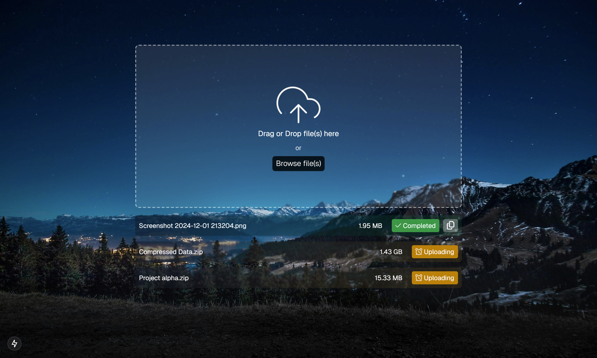

# Cloudflare R2 bucket Multipart File Uploader / NextJs 15

A minimal and flexible uploader component tailored for Cloudflare R2 bucket. It supports multipart upload and was tested with files up to 1 GB size.

- R2 blob storage support (or any S3 API compatible storage)
- Tested with 1GB files
- Drag and drop
- Completely server side
- Multipart upload support
- Customizable
- No Complexity
- Built With NextJs 15



The intent of this repo is to provide simple to use and simple to copy and paste file uploader component for Next.js.

The components were written mainly to be used with R2 but any blob storage with a S3-compatible API should work with just a few tweaks.

Good for simple projects or for bootstrapping more complex file-uploading workflows when customized.

# Setup

### Install the dependencies

On your project, run:

```bash
npm install
```

### Set the environment variables

In your `.env` file, set the following environment variables:

```bash
R2_ACCOUNT_ID=
R2_ACCESS_KEY_ID=
R2_SECRET_KEY_ID=
R2_BUCKET_NAME=
```

The values should be available from the R2 management dashboard on Cloudflare.

### Set the CORS settings for the R2 bucket

Create the following CORS settings in order to make the upload components work with your bucket:

```json
[
  {
    "AllowedOrigins": ["*"],
    "AllowedMethods": ["GET", "PUT"],
    "AllowedHeaders": ["Authorization", "content-type"],
    "ExposeHeaders": ["ETag", "Location"],
    "MaxAgeSeconds": 3000
  },
  {
    "AllowedOrigins": ["*"],
    "AllowedMethods": ["GET"],
    "AllowedHeaders": ["*"]
  }
]
```

Optionally, to increase security you can also customize the `AllowedOrigins` properties.

### Run

Run the development server

```bash
npm run dev
```
